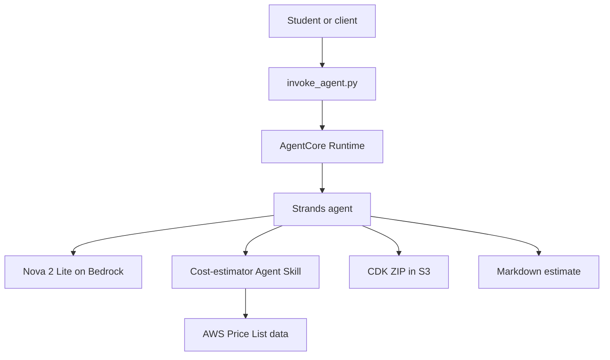

# Beginner Guide v2: From a Local Ollama Agent to an AWS Cost-Estimator Agent on Bedrock AgentCore

**Guide version:** 2.0  
**Last reviewed:** August 27, 2026  
**Audience:** Students new to AI agents, Amazon Bedrock, Strands Agents, AWS Agent Skills, AWS CDK, and Amazon Bedrock AgentCore  
**Lab style:** Build locally first, validate each layer, and deploy only the agent—not the sample infrastructure

---

## Table of Contents

1. [Lab summary](#1-lab-summary)
2. [What is an AI agent?](#2-what-is-an-ai-agent)
3. [Ways to create and run an agent](#3-ways-to-create-and-run-an-agent)
4. [What is an Agent Skill?](#4-what-is-an-agent-skill)
5. [Part A: Build a basic local agent with Ollama](#5-part-a-build-a-basic-local-agent-with-ollama)
6. [Move from Ollama to Amazon Bedrock](#6-move-from-ollama-to-amazon-bedrock)
7. [Part B: Build the AWS cost-estimator agent](#7-part-b-build-the-aws-cost-estimator-agent)
8. [Why create a separate sample CDK deployment?](#8-why-create-a-separate-sample-cdk-deployment)
9. [Create and package the sample CDK deployment](#9-create-and-package-the-sample-cdk-deployment)
10. [Run the Bedrock agent locally with Python](#10-run-the-bedrock-agent-locally-with-python)
11. [Create the AgentCore deployment project](#11-create-the-agentcore-deployment-project)
12. [Run through `agentcore dev`](#12-run-through-agentcore-dev)
13. [Dry run and deploy to AgentCore Runtime](#13-dry-run-and-deploy-to-agentcore-runtime)
14. [Grant runtime access to the CDK input](#14-grant-runtime-access-to-the-cdk-input)
15. [Invoke the deployed agent](#15-invoke-the-deployed-agent)
16. [What the successful execution proves](#16-what-the-successful-execution-proves)
17. [Virtual environments: why they were created and deleted](#17-virtual-environments-why-they-were-created-and-deleted)
18. [Edge cases, corrections, and troubleshooting](#18-edge-cases-corrections-and-troubleshooting)
19. [Security guidance](#19-security-guidance)
20. [Cleanup](#20-cleanup)
21. [Recommended next improvements](#21-recommended-next-improvements)
22. [References](#22-references)

---

## 1. Lab Summary

This lab teaches the evolution of an agent in four stages:

1. Build a small agent locally with a local LLM served by Ollama.
2. Replace Ollama with Amazon Nova 2 Lite through Amazon Bedrock.
3. Add an AWS `cost-estimator` Agent Skill and a sample CDK project for the agent to analyze.
4. Test the agent locally and deploy the same Python application to Amazon Bedrock AgentCore Runtime.

The completed agent can:

- Read instructions from the AWS `cost-estimator` Agent Skill.
- Download a zipped CDK project from Amazon S3.
- Detect resources such as a NAT Gateway and an EC2 instance.
- Query AWS Price List data through the skill's pricing script.
- Calculate an estimated monthly cost.
- Return a Markdown report with assumptions and exclusions.

The lab deliberately does **not** deploy the sample VPC, NAT Gateway, or EC2 instance. Only the agent is deployed.

### Final architecture



### Final directory layout

```text
100-ckp-agent-apps/
├── local_agent-on-aws/          # Agent source and AWS Agent Skill
├── sample-cdk-deployment/       # Workload analyzed by the agent
├── sample-cdk-deployment.zip    # S3 input artifact
└── CostEstimatorProject/        # AgentCore deployment configuration and invoker
```

---

## 2. What Is an AI Agent?

An LLM by itself accepts input and generates output:

```text
User prompt -> LLM -> Answer
```

An agent surrounds the LLM with instructions, tools, an execution loop, and often memory, security controls, and observability:

```text
User request
    -> model decides what to do
    -> optional tool call
    -> application executes the tool
    -> tool result returns to the model
    -> model decides whether another action is needed
    -> final answer
```

### Core agent components

| Component | Purpose | Example in this lab |
|---|---|---|
| Model | Understands the request and chooses actions | Qwen through Ollama, then Nova 2 Lite through Bedrock |
| System instructions | Define role, constraints, and behavior | “Never invent a unit price” |
| Tools | Perform actions or retrieve facts | Inspect CDK source, query pricing, calculate cost |
| Agent loop | Repeats model and tool calls until complete | Manual Python loop, then Strands `Agent` |
| State or memory | Retains conversation or task context | Message list; AgentCore Memory can be added later |
| Runtime | Hosts and executes the agent application | Local Python, then AgentCore Runtime |
| Identity and permissions | Control AWS/API access | Local AWS profile and AgentCore execution role |
| Observability | Records model and tool behavior | Local logs and AgentCore/CloudWatch traces |
| Evaluation | Checks whether answers and actions are correct | Expected tools, expected resources, cost-total checks |

### Agent versus chatbot

A chatbot mainly generates text. An agent can decide to use tools and can perform multiple reasoning–action cycles before producing its answer.

For example, the cost agent does not simply answer from model memory. It can:

1. Call `inspect_cdk_project`.
2. Find a NAT Gateway and EC2 instance.
3. Call `query_aws_pricing` for relevant unit prices.
4. Call `calculate_monthly_cost`.
5. Assemble a report.

That model–tool–observation loop is the essential agent behavior.

---

## 3. Ways to Create and Run an Agent

Agent creation and agent hosting are separate decisions.

### 3.1 Ways to create the agent logic

| Approach | What you write | Best use |
|---|---|---|
| Manual Python loop | Messages, tool schema, tool dispatch, loop | Learning how agents work |
| Agent framework | Agent, tools, prompts, hooks, state | Most application development |
| Managed harness | Configuration for model, tools, and instructions | Fast start with less orchestration code |
| Managed agent service | Service-specific actions, knowledge, and orchestration | Teams wanting a more managed AWS experience |

Examples of agent frameworks include Strands Agents, LangGraph, LangChain, LlamaIndex, CrewAI, Google ADK, and OpenAI Agents SDK. This lab uses a manual loop with Ollama and then Strands Agents with Bedrock.

### 3.2 Ways to run an agent

| Runtime choice | Model location | Agent code location | Typical purpose |
|---|---|---|---|
| Local Python + Ollama | Local computer | Local computer | Learning, privacy, offline experiments |
| Local Python + Bedrock | AWS managed model | Local computer | Develop against the production model |
| Container/VM | Local or remote | EC2, ECS, EKS, or another platform | Full infrastructure control |
| AgentCore Runtime | Bedrock or another provider | AWS managed microVM runtime | Secure, scalable managed agent hosting |
| AgentCore Harness | Bedrock or supported provider | Managed loop/configuration | Less custom orchestration code |

### 3.3 Choice made in this lab

The lab uses:

```text
Creation framework: Strands Agents
Model provider: Amazon Bedrock
Model: Amazon Nova 2 Lite
Managed host: Amazon Bedrock AgentCore Runtime
Deployment format: CodeZip
Protocol: HTTP
```

AgentCore Runtime hosts `main.py`. It does not run the Nova model itself; model inference remains an Amazon Bedrock call.

> **AWS naming clarification:** this lab builds a custom Strands agent that calls a Bedrock model and is hosted by **Amazon Bedrock AgentCore Runtime**. It does not create an **Agent for Amazon Bedrock**, which is a separate managed orchestration service.

---

## 4. What Is an Agent Skill?

An Agent Skill is a reusable folder that teaches an agent how to perform a specific class of task.

A typical skill contains:

```text
skill-name/
├── SKILL.md          # Description, triggers, workflow, constraints
├── references/       # Detailed guidance loaded when needed
├── scripts/          # Deterministic helper programs
└── assets/           # Templates or supporting files
```

### 4.1 Why use skills?

Skills provide:

- Reusable domain procedures.
- Consistent steps across agents.
- Service-specific knowledge and warnings.
- Progressive disclosure: load detailed guidance only when required.
- Deterministic scripts for operations that should not be improvised by the model.
- Easier review and versioning than embedding every instruction in `main.py`.

### 4.2 A skill is not automatically a Python tool

This distinction is important:

- `SKILL.md` tells the model what workflow to follow.
- A Python tool gives the running agent an executable capability.
- A skill script is usable only if the runtime can execute it through a controlled tool or sandbox.

Strands and AgentCore Runtime do not automatically discover any arbitrary skill directory copied into a project. In this lab, `main.py` explicitly:

1. Reads `SKILL.md` and selected references.
2. Adds those instructions to the system prompt.
3. Exposes safe Python tools for S3 inspection, pricing lookup, and calculation.
4. Calls the original skill pricing script through a restricted subprocess command.

### 4.3 Skill used in this lab

The AWS sample `cost-estimator` skill contains:

```text
cost-estimator/
├── SKILL.md
├── README.md
├── references/
│   ├── cdk-analysis.md
│   ├── pricing-api.md
│   ├── report-generation.md
│   └── bedrock-pricing.md
└── scripts/
    ├── fetch-aws-pricing.py
    ├── generate-pricing-excel.py
    └── bedrock-fallback-prices.json
```

Its purpose is to inspect synthesizable CDK projects, retrieve AWS pricing, and produce cost reports.

### 4.4 Where to get AWS Agent Skills

Useful sources include:

- [AWS sample Agent Skills for builders](https://github.com/aws-samples/sample-agent-skills-for-builders)
- [AWS Agent Toolkit skills documentation](https://docs.aws.amazon.com/agent-toolkit/latest/userguide/skills.html)
- AWS or AWS Labs repositories that explicitly publish Agent Skills
- Internal skills reviewed and maintained by your organization

Treat skills as executable supply-chain inputs. Review `SKILL.md`, all scripts, referenced commands, network access, and required IAM permissions before using a third-party skill.

---

## 5. Part A: Build a Basic Local Agent with Ollama

This first agent runs both the application and the LLM locally.

### 5.1 Install and test Ollama

Install Ollama from its [official download page](https://ollama.com/download), then pull a tool-capable model:

```bash
ollama pull qwen3:4b
```

Test it:

```bash
ollama run qwen3:4b
```

Enter a prompt, then use `/bye` to exit.

### 5.2 Create the project

```bash
mkdir local-ollama-agent
cd local-ollama-agent

python3 -m venv .venv
source .venv/bin/activate
python -m pip install --upgrade ollama
```

### 5.3 Create `agent.py`

```python
"""Small local tool-using agent powered by Ollama."""

from datetime import datetime

from ollama import chat


MODEL = "qwen3:4b"


def get_current_time() -> str:
    """Return the current local date and time."""
    return datetime.now().astimezone().isoformat(timespec="seconds")


def add(a: int, b: int) -> int:
    """Add two integers.

    Args:
        a: First integer.
        b: Second integer.
    """
    return a + b


def multiply(a: int, b: int) -> int:
    """Multiply two integers.

    Args:
        a: First integer.
        b: Second integer.
    """
    return a * b


TOOLS = {
    "get_current_time": get_current_time,
    "add": add,
    "multiply": multiply,
}


def run_agent(user_request: str) -> str:
    messages = [
        {
            "role": "system",
            "content": (
                "You are a helpful local agent. Use tools when needed. "
                "Never invent a tool result."
            ),
        },
        {"role": "user", "content": user_request},
    ]

    # The limit prevents accidental infinite tool loops.
    for _ in range(10):
        response = chat(
            model=MODEL,
            messages=messages,
            tools=list(TOOLS.values()),
        )

        messages.append(response.message)
        tool_calls = response.message.tool_calls or []

        if not tool_calls:
            return response.message.content

        for tool_call in tool_calls:
            name = tool_call.function.name
            arguments = tool_call.function.arguments
            function = TOOLS.get(name)

            print(f"Calling tool: {name}({arguments})")

            if function is None:
                result = f"Unknown tool: {name}"
            else:
                try:
                    result = function(**arguments)
                except Exception as error:
                    result = f"Tool failed: {error}"

            messages.append(
                {
                    "role": "tool",
                    "tool_name": name,
                    "content": str(result),
                }
            )

    return "Agent stopped after reaching the tool-call limit."


if __name__ == "__main__":
    print("Local Ollama Agent. Type 'exit' to stop.\n")

    while True:
        prompt = input("You: ").strip()

        if prompt.lower() in {"exit", "quit"}:
            break

        if prompt:
            print(f"Agent: {run_agent(prompt)}\n")
```

### 5.4 Run it

```bash
python agent.py
```

Test:

```text
What is the current time?
```

```text
Calculate (11434 + 12341) * 412.
```

The agent should call `add`, then `multiply`, and return the result. This demonstrates a real agent loop rather than a single chatbot response.

---

## 6. Move from Ollama to Amazon Bedrock

The local version is useful for learning, but a managed cloud implementation needs a remotely available model and a managed runtime.

### 6.1 Component mapping

| Ollama version | AWS version |
|---|---|
| Qwen model on laptop | Nova 2 Lite on Amazon Bedrock |
| Ollama Python client | Strands `BedrockModel` |
| Manual `for` loop | Strands `Agent` loop |
| Local Python functions | Strands `@tool` functions |
| Local terminal process | Local AgentCore-compatible server, then AgentCore Runtime |
| Local credentials not required | AWS profile locally and IAM execution role in AgentCore |

### 6.2 Why not run Ollama inside AgentCore Runtime?

Ollama is a model server that needs model weights plus sufficient CPU/GPU memory. AgentCore Runtime is intended to host agent applications, not to act as an Ollama GPU model host.

The recommended first AWS pattern is:

```text
AgentCore Runtime -> Amazon Bedrock -> Nova model
```

If an organization must use an Ollama-hosted model, host Ollama separately on appropriate EC2, ECS, or EKS compute and expose a secured API. AgentCore can then call that endpoint, but that is a more advanced architecture.

### 6.3 Minimal Bedrock and Strands conversion

The manual Ollama loop:

```python
response = chat(model=MODEL, messages=messages, tools=tools)
```

becomes a Strands agent backed by Bedrock:

```python
from strands import Agent, tool
from strands.models.bedrock import BedrockModel


@tool
def add(a: int, b: int) -> int:
    """Add two integers."""
    return a + b


model = BedrockModel(
    model_id="global.amazon.nova-2-lite-v1:0",
    region_name="us-east-1",
)

agent = Agent(
    model=model,
    system_prompt="Use tools when needed. Never invent tool results.",
    tools=[add],
)

result = agent("Add 250 and 375")
print(result.message["content"][0]["text"])
```

Strands now owns the model–tool loop. The business tools and safety rules remain your responsibility.

---

## 7. Part B: Build the AWS Cost-Estimator Agent

### 7.1 Prerequisites

Use macOS/Linux commands for this lab. Install:

- Python 3.10 or later
- Node.js 22 LTS recommended
- AWS CLI v2
- AWS CDK CLI
- `uv`
- Git and ZIP
- AgentCore CLI

```bash
npm install -g aws-cdk
npm install -g @aws/agentcore@latest
```

Verify:

```bash
python3 --version
node --version
aws --version
cdk --version
uv --version
agentcore --version
```

Enable Amazon Nova 2 Lite access in Amazon Bedrock in `us-east-1`.

### 7.2 Configure a named AWS profile

```bash
aws configure --profile agentcore-poc
```

Do not paste quotation marks around credentials. Do not create root access keys.

Set variables:

```bash
export LAB_AWS_PROFILE=agentcore-poc
export LAB_AWS_REGION=us-east-1
export LAB_AWS_ACCOUNT_ID="$(aws sts get-caller-identity \
  --profile "$LAB_AWS_PROFILE" \
  --query Account \
  --output text)"
```

Verify:

```bash
aws sts get-caller-identity --profile "$LAB_AWS_PROFILE"
```

### 7.3 Create the source directory and add the skill

From a working parent directory:

```bash
mkdir -p 100-ckp-agent-apps/local_agent-on-aws/skills
cd 100-ckp-agent-apps/local_agent-on-aws
```

Copy the AWS sample skill:

```bash
git clone --depth 1 \
  https://github.com/aws-samples/sample-agent-skills-for-builders.git \
  /tmp/sample-agent-skills-for-builders

cp -R \
  /tmp/sample-agent-skills-for-builders/skills/cost-estimator \
  skills/
```

Expected:

```text
local_agent-on-aws/
├── main.py
├── pyproject.toml
└── skills/
    └── cost-estimator/
        ├── SKILL.md
        ├── README.md
        ├── references/
        └── scripts/
```

### 7.4 Create `pyproject.toml`

```toml
[project]
name = "cost-estimator-agent"
version = "0.1.0"
description = "AgentCore agent using the AWS cost-estimator Agent Skill"
requires-python = ">=3.10"
dependencies = [
    "aws-opentelemetry-distro",
    "bedrock-agentcore>=1.8.0",
    "boto3",
    "botocore[crt]>=1.35.0",
    "strands-agents[otel]>=1.13.0",
    "opentelemetry-distro",
    "opentelemetry-instrumentation",
    "uvicorn>=0.30.0",
]
```

The `[project]` section is essential. Without it, AgentCore may create an environment but fail to install `uvicorn`.

### 7.5 Create `main.py`

The following implementation loads the skill, downloads the CDK ZIP safely, invokes the original pricing script, and exposes an AgentCore entry point.

```python
"""AgentCore agent using AWS's cost-estimator Agent Skill."""

from __future__ import annotations

import hashlib
import json
import os
import re
import shutil
import subprocess
import tempfile
import zipfile
from pathlib import Path
from typing import Any

import boto3
from bedrock_agentcore.runtime import BedrockAgentCoreApp, BedrockAgentCoreContext
from botocore.exceptions import BotoCoreError, ClientError
from strands import Agent, tool
from strands.models.bedrock import BedrockModel


APP_DIR = Path(__file__).resolve().parent
SKILL_DIR = APP_DIR / "skills" / "cost-estimator"
SKILL_SCRIPT = SKILL_DIR / "scripts" / "fetch-aws-pricing.py"

AWS_REGION = os.getenv("AWS_REGION", "us-east-1")
MODEL_ID = os.getenv("MODEL_ID", "global.amazon.nova-2-lite-v1:0")

MAX_PROJECT_BYTES = 25 * 1024 * 1024
MAX_SOURCE_CHARACTERS = 120_000

app = BedrockAgentCoreApp()


def read_skill_file(relative_path: str) -> str:
    path = SKILL_DIR / relative_path
    if not path.exists():
        raise RuntimeError(f"Required Agent Skill file is missing: {path}")
    return path.read_text(encoding="utf-8")


SKILL_INSTRUCTIONS = f"""
You are an AWS infrastructure cost-estimation agent.

Follow this Agent Skill:

<skill>
{read_skill_file("SKILL.md")}
</skill>

<cdk-analysis>
{read_skill_file("references/cdk-analysis.md")}
</cdk-analysis>

<pricing-api>
{read_skill_file("references/pricing-api.md")}
</pricing-api>

<report-generation>
{read_skill_file("references/report-generation.md")}
</report-generation>

Runtime rules:

1. Treat every result as an estimate, not an AWS quotation.
2. State all usage assumptions.
3. Never invent a unit price.
4. Use query_aws_pricing for material cost items.
5. Mark unavailable prices as unresolved rather than guessing.
6. Keep fixed monthly charges separate from variable usage charges.
7. Do not deploy, modify, or delete AWS resources.
"""


def parse_s3_uri(s3_uri: str) -> tuple[str, str]:
    match = re.fullmatch(r"s3://([^/]+)/(.+)", s3_uri)
    if not match:
        raise ValueError("Expected an S3 URI such as s3://bucket/project.zip")
    return match.group(1), match.group(2)


def safe_extract(archive: zipfile.ZipFile, destination: Path) -> None:
    resolved_destination = destination.resolve()

    for member in archive.infolist():
        member_path = (destination / member.filename).resolve()
        if member_path != resolved_destination and resolved_destination not in member_path.parents:
            raise ValueError(f"Unsafe ZIP path: {member.filename}")

    archive.extractall(destination)


@tool
def inspect_cdk_project(s3_uri: str) -> str:
    """Download and inspect a zipped AWS CDK project from S3.

    Args:
        s3_uri: S3 URI of the zipped CDK project.

    Returns:
        JSON containing relevant CDK source and documentation files.
    """

    try:
        bucket, key = parse_s3_uri(s3_uri)
        digest = hashlib.sha256(s3_uri.encode()).hexdigest()[:16]
        workspace = Path(tempfile.gettempdir()) / "cost-estimator" / digest
        archive_path = workspace / "project.zip"
        source_dir = workspace / "source"

        workspace.mkdir(parents=True, exist_ok=True)

        s3 = boto3.client("s3", region_name=AWS_REGION)
        metadata = s3.head_object(Bucket=bucket, Key=key)
        size = metadata.get("ContentLength", 0)

        if size > MAX_PROJECT_BYTES:
            return json.dumps({
                "status": "error",
                "message": f"Archive exceeds {MAX_PROJECT_BYTES} bytes",
            })

        s3.download_file(bucket, key, str(archive_path))
        shutil.rmtree(source_dir, ignore_errors=True)
        source_dir.mkdir(parents=True)

        with zipfile.ZipFile(archive_path) as archive:
            safe_extract(archive, source_dir)

        ignored = {"node_modules", ".git", ".venv", "cdk.out", "dist", "build"}
        suffixes = {".py", ".ts", ".tsx", ".json", ".yaml", ".yml", ".md"}
        files = []
        consumed = 0

        for path in sorted(source_dir.rglob("*")):
            if not path.is_file():
                continue

            relative = path.relative_to(source_dir)
            if any(part in ignored for part in relative.parts):
                continue
            if path.suffix.lower() not in suffixes and path.name != "cdk.json":
                continue

            try:
                content = path.read_text(encoding="utf-8")
            except UnicodeDecodeError:
                continue

            remaining = MAX_SOURCE_CHARACTERS - consumed
            if remaining <= 0:
                break

            content = content[:remaining]
            consumed += len(content)
            files.append({"path": str(relative), "content": content})

        return json.dumps({
            "status": "success",
            "files_returned": len(files),
            "truncated": consumed >= MAX_SOURCE_CHARACTERS,
            "files": files,
        })

    except (ValueError, zipfile.BadZipFile, ClientError, BotoCoreError) as error:
        return json.dumps({
            "status": "error",
            "error_type": type(error).__name__,
            "message": str(error),
        })


@tool
def query_aws_pricing(
    region: str,
    offer_code: str,
    filters: dict[str, str],
) -> str:
    """Retrieve current public AWS pricing using the skill's script.

    Args:
        region: AWS Region such as us-east-1.
        offer_code: Price List offer code such as AmazonEC2 or AmazonVPC.
        filters: Product attribute filters.
    """

    if not re.fullmatch(r"[a-z]{2}(?:-gov)?-[a-z]+-\d+", region):
        return json.dumps({"status": "error", "message": "Invalid AWS Region"})

    if not re.fullmatch(r"[A-Za-z0-9]+", offer_code):
        return json.dumps({"status": "error", "message": "Invalid offer code"})

    command = [
        "python3",
        str(SKILL_SCRIPT),
        region,
        "--offer-code",
        offer_code,
    ]

    for key, value in filters.items():
        if not re.fullmatch(r"[A-Za-z0-9_-]+", key):
            return json.dumps({"status": "error", "message": "Invalid filter key"})
        command.extend(["--filter", f"{key}={value}"])

    command.extend([
        "--cache-dir",
        str(Path(tempfile.gettempdir()) / "cost-estimator" / "pricing-cache"),
    ])

    try:
        result = subprocess.run(
            command,
            capture_output=True,
            text=True,
            timeout=240,
            check=False,
            shell=False,
        )
    except subprocess.TimeoutExpired:
        return json.dumps({"status": "error", "message": "Pricing query timed out"})

    if result.returncode != 0:
        return json.dumps({
            "status": "error",
            "exit_code": result.returncode,
            "message": result.stderr[-2000:],
        })

    return result.stdout


@tool
def calculate_monthly_cost(unit_price: float, monthly_quantity: float) -> str:
    """Calculate monthly cost from a unit price and monthly quantity."""

    if unit_price < 0 or monthly_quantity < 0:
        return json.dumps({"status": "error", "message": "Values cannot be negative"})

    return json.dumps({
        "unit_price": unit_price,
        "monthly_quantity": monthly_quantity,
        "estimated_monthly_cost": round(unit_price * monthly_quantity, 4),
    })


model = BedrockModel(model_id=MODEL_ID, region_name=AWS_REGION)

agent = Agent(
    model=model,
    system_prompt=SKILL_INSTRUCTIONS,
    tools=[inspect_cdk_project, query_aws_pricing, calculate_monthly_cost],
)


@app.entrypoint
def invoke(
    payload: dict[str, Any],
    context: BedrockAgentCoreContext,
) -> dict[str, Any]:
    """AgentCore Runtime entry point."""

    prompt = payload.get("prompt")
    s3_uri = payload.get("cdk_project_s3_uri")
    region = payload.get("region", AWS_REGION)

    if not isinstance(prompt, str) or not prompt.strip():
        return {"status": "error", "message": "A non-empty prompt is required"}

    if not isinstance(s3_uri, str) or not s3_uri.startswith("s3://"):
        return {"status": "error", "message": "A CDK project S3 URI is required"}

    request = f"""
User request:
{prompt}

Deployment region: {region}
CDK project: {s3_uri}

Follow the cost-estimator skill workflow:

1. Inspect the CDK project.
2. Identify resources and configurations.
3. State all usage assumptions.
4. Query pricing for material resources.
5. Calculate fixed and variable monthly costs separately.
6. Return a concise Markdown report.

Do not deploy the project.
"""

    result = agent(request)

    return {
        "status": "success",
        "response": result.message["content"][0]["text"],
        "session_id": getattr(context, "session_id", None),
    }


if __name__ == "__main__":
    app.run()
```

Validate syntax:

```bash
python3 -m py_compile main.py
```

No output means the syntax is valid.

---

## 8. Why Create a Separate Sample CDK Deployment?

The `cost-estimator` skill expects a real CDK project as analysis input. The agent source itself is not that input.

The separate `sample-cdk-deployment` provides:

- Known resources students can recognize.
- A stable input for resource discovery.
- A meaningful reason to call pricing tools.
- A safe workload that can be synthesized without deployment.
- A clean boundary between the analyzer and the thing being analyzed.

### What could go wrong without it?

| Missing separation | Likely result |
|---|---|
| No CDK project | Agent returns generic advice instead of a deployment estimate |
| Original empty CDK project | Only CDK metadata is found; estimate is zero or meaningless |
| Agent directory used as input | Agent analyzes the wrong files |
| Workload mixed into agent source | Extra files can be packaged into AgentCore CodeZip |
| Student runs `cdk deploy` | Chargeable NAT Gateway or EC2 resources may be created |

The correct rule is:

```text
Use cdk synth to validate the sample.
Do not use cdk deploy for the sample.
```

`cdk synth` converts CDK code into a local CloudFormation template. It does not create AWS infrastructure.

---

## 9. Create and Package the Sample CDK Deployment

### 9.1 Initialize the project

From `100-ckp-agent-apps`:

```bash
mkdir sample-cdk-deployment
cd sample-cdk-deployment
cdk init app --language python
```

Expected:

```text
sample-cdk-deployment/
├── app.py
├── cdk.json
├── requirements.txt
├── sample_cdk_deployment/
│   ├── __init__.py
│   └── sample_cdk_deployment_stack.py
└── tests/
```

### 9.2 Install dependencies and synthesize the empty project

```bash
source .venv/bin/activate
python -m pip install -r requirements.txt
cdk synth
```

The first synthesis validates the generated project. Because the stack is empty, the output contains little more than `AWS::CDK::Metadata`.

### 9.3 Add a VPC, NAT Gateway, and EC2 instance

Replace `sample_cdk_deployment/sample_cdk_deployment_stack.py`:

```python
from aws_cdk import Stack, aws_ec2 as ec2
from constructs import Construct


class SampleCdkDeploymentStack(Stack):

    def __init__(
        self,
        scope: Construct,
        construct_id: str,
        **kwargs,
    ) -> None:
        super().__init__(scope, construct_id, **kwargs)

        vpc = ec2.Vpc(
            self,
            "SampleVpc",
            max_azs=2,
            nat_gateways=1,
        )

        ec2.Instance(
            self,
            "ApplicationServer",
            vpc=vpc,
            instance_type=ec2.InstanceType("t3.micro"),
            machine_image=ec2.MachineImage.latest_amazon_linux2023(),
            vpc_subnets=ec2.SubnetSelection(
                subnet_type=ec2.SubnetType.PRIVATE_WITH_EGRESS,
            ),
        )
```

Synthesize again:

```bash
cdk synth
```

Expected resources include the VPC, subnets, route tables, Internet Gateway, NAT Gateway, Elastic IP, security group, and EC2 instance.

Do not run `cdk deploy`.

### 9.4 Package the source

While still inside `sample-cdk-deployment`:

```bash
zip -r ../sample-cdk-deployment.zip . \
  -x ".venv/*" \
  -x "cdk.out/*" \
  -x ".git/*" \
  -x "*/__pycache__/*" \
  -x "*.pyc" \
  -x ".DS_Store"
```

We package source code because the skill's discovery instructions inspect CDK source. The locally generated `cdk.out` is not required for this implementation.

### 9.5 Create the S3 bucket and upload

```bash
export LAB_INPUT_BUCKET="ckp-agentcore-cost-input-${LAB_AWS_ACCOUNT_ID}-${LAB_AWS_REGION}"

aws s3 mb \
  "s3://${LAB_INPUT_BUCKET}" \
  --region "$LAB_AWS_REGION" \
  --profile "$LAB_AWS_PROFILE"
```

Upload:

```bash
aws s3 cp \
  ../sample-cdk-deployment.zip \
  "s3://${LAB_INPUT_BUCKET}/deployments/sample-cdk-deployment.zip" \
  --profile "$LAB_AWS_PROFILE"
```

---

## 10. Run the Bedrock Agent Locally with Python

The application runs locally, but model inference occurs in Amazon Bedrock.

### 10.1 Create a local environment outside agent source

Keep the environment outside `local_agent-on-aws` so it cannot be accidentally packaged:

```bash
cd ../local_agent-on-aws
mkdir -p ../.venvs
python3 -m venv ../.venvs/cost-estimator-agent
source ../.venvs/cost-estimator-agent/bin/activate
python -m pip install -e .
```

### 10.2 Start the server

```bash
AWS_PROFILE="$LAB_AWS_PROFILE" \
AWS_REGION="$LAB_AWS_REGION" \
python main.py
```

The terminal appears to be “stuck” because the HTTP server is running and waiting for requests. That is expected.

### 10.3 Check health

From a second terminal:

```bash
curl -s http://localhost:8080/ping
```

Expected:

```json
{"status":"Healthy"}
```

### 10.4 Invoke locally

```bash
curl -sS --max-time 600 \
  -X POST http://localhost:8080/invocations \
  -H "Content-Type: application/json" \
  -d "{
    \"prompt\": \"Estimate the recurring monthly cost. State assumptions and exclusions.\",
    \"region\": \"${LAB_AWS_REGION}\",
    \"cdk_project_s3_uri\": \"s3://${LAB_INPUT_BUCKET}/deployments/sample-cdk-deployment.zip\"
  }"
```

Stop with `Ctrl+C`.

### What ran where?

```text
Local computer:
- main.py
- Strands loop
- Python tools
- HTTP server

AWS:
- Nova inference through Bedrock
- S3 object read using local AWS credentials

Public endpoint:
- AWS Price List Bulk API used by the skill script
```

---

## 11. Create the AgentCore Deployment Project

From `local_agent-on-aws`:

```bash
agentcore create \
  --name CostEstimatorProject \
  --no-agent \
  --output-dir .. \
  --skip-git \
  --skip-python-setup \
  --skip-install
```

Expected sibling directory:

```text
100-ckp-agent-apps/
├── CostEstimatorProject/
├── local_agent-on-aws/
├── sample-cdk-deployment/
└── sample-cdk-deployment.zip
```

Enter it:

```bash
cd ../CostEstimatorProject
```

Register existing code as a Bring Your Own agent:

```bash
agentcore add agent \
  --name CostEstimatorAgent \
  --type byo \
  --code-location ../local_agent-on-aws \
  --entrypoint main.py \
  --language Python \
  --framework Strands \
  --model-provider Bedrock \
  --protocol HTTP \
  --build CodeZip
```

The current CLI requires `--framework Strands` during BYO registration. Omitting it produced:

```text
--framework is required
```

The registration is stored in:

```text
CostEstimatorProject/agentcore/agentcore.json
```

The Python code remains in `local_agent-on-aws`; it is referenced, not replaced.

Validate:

```bash
agentcore validate
```

Expected:

```text
Valid
```

Install deployment dependencies:

```bash
npm install --prefix agentcore/cdk
```

Do not blindly run `npm audit fix`; forced upgrades can make generated CDK tooling incompatible.

---

## 12. Run Through `agentcore dev`

`agentcore dev` verifies the registered BYO configuration and starts an AgentCore-compatible local environment.

```bash
AWS_PROFILE="$LAB_AWS_PROFILE" \
AWS_REGION="$LAB_AWS_REGION" \
agentcore dev --no-browser --logs
```

Successful startup includes:

```text
Uvicorn running on http://127.0.0.1:8080
Application startup complete
```

OpenTelemetry duplicate-instrumentation messages can appear as warnings. They do not necessarily block startup.

Stop with `Ctrl+C`.

AgentCore development mode creates:

```text
local_agent-on-aws/.venv
```

Delete that generated environment before CodeZip deployment:

```bash
rm -rf ../local_agent-on-aws/.venv
```

This step prevents local binaries from being packaged for a Linux ARM64 runtime.

---

## 13. Dry Run and Deploy to AgentCore Runtime

### 13.1 Dry run

```bash
AWS_PROFILE="$LAB_AWS_PROFILE" \
AWS_REGION="$LAB_AWS_REGION" \
agentcore deploy --dry-run
```

This validates configuration, builds the generated CDK project, and synthesizes CloudFormation without deploying the agent.

### 13.2 Bootstrap if required

If output says:

```text
AWS environment needs bootstrapping
```

run:

```bash
AWS_PROFILE="$LAB_AWS_PROFILE" \
AWS_REGION="$LAB_AWS_REGION" \
agentcore deploy --dry-run --yes
```

Bootstrapping creates the standard CDK deployment roles and asset resources. It does not deploy the sample VPC.

### 13.3 Deploy

Verify again that no virtual environment exists inside `local_agent-on-aws`, then run:

```bash
AWS_PROFILE="$LAB_AWS_PROFILE" \
AWS_REGION="$LAB_AWS_REGION" \
agentcore deploy --yes
```

Check status:

```bash
AWS_PROFILE="$LAB_AWS_PROFILE" \
AWS_REGION="$LAB_AWS_REGION" \
agentcore status
```

Expected:

```text
CostEstimatorAgent: Deployed - Runtime: READY
```

Record:

- Runtime ID
- Runtime ARN
- Execution role ARN

The AgentCore deployment creates the agent runtime and supporting resources. It does not run `cdk deploy` inside `sample-cdk-deployment`.

---

## 14. Grant Runtime Access to the CDK Input

Local testing used the local AWS profile. The deployed agent uses its AgentCore execution role.

Retrieve the role:

```bash
export LAB_RUNTIME_ID="<runtime-id-from-agentcore-status>"

export LAB_RUNTIME_ROLE_ARN="$(aws bedrock-agentcore-control get-agent-runtime \
  --agent-runtime-id "$LAB_RUNTIME_ID" \
  --region "$LAB_AWS_REGION" \
  --profile "$LAB_AWS_PROFILE" \
  --query roleArn \
  --output text)"

export LAB_RUNTIME_ROLE_NAME="${LAB_RUNTIME_ROLE_ARN##*/}"
```

Create `runtime-s3-policy.json`, replacing `<BUCKET_NAME>`:

```json
{
  "Version": "2012-10-17",
  "Statement": [
    {
      "Sid": "ReadCostEstimatorInputs",
      "Effect": "Allow",
      "Action": "s3:GetObject",
      "Resource": "arn:aws:s3:::<BUCKET_NAME>/deployments/*"
    }
  ]
}
```

Attach:

```bash
aws iam put-role-policy \
  --role-name "$LAB_RUNTIME_ROLE_NAME" \
  --policy-name CostEstimatorReadInput \
  --policy-document file://runtime-s3-policy.json \
  --profile "$LAB_AWS_PROFILE"
```

This is a tightly scoped read permission. In production, define it declaratively in infrastructure as code.

Keep the runtime and input bucket in the same AWS account for the beginner lab. A cross-account bucket requires both identity-based permission and an S3 bucket policy.

---

## 15. Invoke the Deployed Agent

The agent expects a structured JSON payload with three fields. A Python invoker is clearer than a long shell command.

Create `CostEstimatorProject/invoke_agent.py`:

```python
"""Invoke the deployed AgentCore cost-estimator agent."""

import json
import os
import uuid

import boto3


AWS_REGION = os.getenv("AWS_REGION", "us-east-1")
AGENT_RUNTIME_ARN = os.environ["AGENT_RUNTIME_ARN"]
CDK_PROJECT_S3_URI = os.environ["CDK_PROJECT_S3_URI"]


def main() -> None:
    client = boto3.client("bedrock-agentcore", region_name=AWS_REGION)

    payload = {
        "prompt": (
            "Estimate the recurring monthly cost of this CDK deployment. "
            "Clearly state all assumptions and excluded costs."
        ),
        "region": AWS_REGION,
        "cdk_project_s3_uri": CDK_PROJECT_S3_URI,
    }

    response = client.invoke_agent_runtime(
        agentRuntimeArn=AGENT_RUNTIME_ARN,
        runtimeSessionId=str(uuid.uuid4()),
        qualifier="DEFAULT",
        payload=json.dumps(payload).encode("utf-8"),
    )

    body = response["response"].read().decode("utf-8")

    try:
        print(json.dumps(json.loads(body), indent=2))
    except json.JSONDecodeError:
        print(body)


if __name__ == "__main__":
    main()
```

Set values:

```bash
export AGENT_RUNTIME_ARN="<runtime-arn-from-agentcore-status>"
export CDK_PROJECT_S3_URI="s3://${LAB_INPUT_BUCKET}/deployments/sample-cdk-deployment.zip"
```

Invoke:

```bash
AWS_PROFILE="$LAB_AWS_PROFILE" \
AWS_REGION="$LAB_AWS_REGION" \
uv run --isolated --with boto3 python invoke_agent.py
```

Expected structure:

```json
{
  "status": "success",
  "response": "...Markdown cost report...",
  "session_id": "..."
}
```

`agentcore invoke --prompt` is convenient for entry points that need only a prompt. This lab uses Boto3 because its custom entry point also requires `region` and `cdk_project_s3_uri`.

---

## 16. What the Successful Execution Proves

A successful deployed response proves the following chain:

```text
invoke_agent.py
    -> signed AgentCore InvokeAgentRuntime API call
    -> main.py running in AgentCore Runtime
    -> Nova 2 Lite invoked through Bedrock
    -> cost-estimator skill instructions loaded
    -> inspect_cdk_project selected by the model
    -> CDK ZIP downloaded from S3 using runtime IAM role
    -> pricing script executed
    -> calculate_monthly_cost invoked when needed
    -> final report returned
```

The minimum acceptance criteria are:

- CDK synthesis succeeds without deployment.
- Local `/ping` reports `Healthy`.
- Local invocation uses Bedrock and returns a resource estimate.
- `agentcore validate` returns `Valid`.
- `agentcore dev` starts successfully.
- Dry run succeeds.
- Runtime reaches `READY`.
- Runtime role can read the S3 ZIP.
- Deployed invocation returns `status: success`.
- At least the NAT Gateway and EC2 instance are detected.
- At least one unit price is grounded through a pricing tool.

This proves the integration. It does not prove that every AWS billing dimension is implemented.

---

## 17. Virtual Environments: Why They Were Created and Deleted

Virtual environments isolate Python dependencies. The lab uses several environments for different reasons.

| Environment | Why created | Treatment |
|---|---|---|
| `local-ollama-agent/.venv` | Ollama client for Part A | Keep inside the standalone Ollama project |
| `sample-cdk-deployment/.venv` | CDK Python dependencies | Keep locally; exclude from the CDK ZIP |
| `100-ckp-agent-apps/.venvs/cost-estimator-agent` | Local Bedrock-agent test dependencies | Keep; it is outside agent source |
| `local_agent-on-aws/.venv` | Automatically created by `agentcore dev` | Delete before CodeZip deploy |
| `uv run --isolated` environment | Boto3 for invoker | Temporary and managed by `uv` |

### Why delete environments from agent source?

A virtual environment contains platform-specific executables and compiled libraries. A `.venv` created on macOS contains macOS binaries. AgentCore Runtime uses Linux ARM64 microVMs.

If the local environment is included in CodeZip, deployment can fail with:

```text
Your artifact contains binary files that are incompatible with Linux ARM64
```

The correction is to remove only reproducible environments from `local_agent-on-aws`:

```bash
rm -rf ../local_agent-on-aws/.venv
rm -rf ../local_agent-on-aws/.sample-agent-venv
```

Do not delete:

```text
main.py
pyproject.toml
skills/
```

Add `local_agent-on-aws/.gitignore`:

```gitignore
.venv/
.sample-agent-venv/
__pycache__/
*.pyc
.DS_Store
```

Still verify the source directory before deployment; do not assume `.gitignore` is always honored by every packaging path.

---

## 18. Edge Cases, Corrections, and Troubleshooting

### 18.1 `InvalidClientTokenId`

**Cause:** Invalid, expired, quoted, or incomplete credentials.

**Correction:**

```bash
aws configure --profile agentcore-poc
aws sts get-caller-identity --profile agentcore-poc
```

Do not paste quotation marks. Temporary credentials also need the session token.

### 18.2 `aws configure list` shows masked values ending in `"`

**Cause:** Quotation marks were stored as part of the credentials.

**Correction:** Re-enter credentials without quotes in a clean named profile.

### 18.3 Unsupported Node.js warning

**Observed:** CDK warned that Node.js 26 had not been tested.

**Correction:** Use Node.js 22 LTS for the lab.

### 18.4 First `cdk synth` shows only `CDKMetadata`

**Cause:** The generated CDK stack is empty.

**Correction:** Add the VPC/NAT/EC2 code and synthesize again.

### 18.5 The terminal appears stuck after `python main.py`

**Cause:** The HTTP server is running and waiting for requests.

**Correction:** Open another terminal and call `/ping` or `/invocations`. Stop the server with `Ctrl+C` when finished.

### 18.6 `spawn .../.venv/bin/uvicorn ENOENT`

**Cause:** `pyproject.toml` lacked a valid `[project]` section or did not install `uvicorn`.

**Correction:** Use the complete `pyproject.toml` in this guide, delete the incomplete generated `.venv`, and rerun `agentcore dev`.

### 18.7 `--framework is required`

**Cause:** Current CLI BYO validation requires the framework declaration.

**Correction:** Add:

```text
--framework Strands --model-provider Bedrock
```

### 18.8 CDK environment needs bootstrapping

**Cause:** The AWS account/Region has not been prepared for CDK asset deployments.

**Correction:**

```bash
agentcore deploy --dry-run --yes
```

### 18.9 Artifact contains binaries incompatible with Linux ARM64

**Cause:** macOS/x86 virtual environments were included in CodeZip.

**Correction:** Remove all virtual environments inside `local_agent-on-aws`, then deploy again. Keep test environments outside the agent source.

### 18.10 Runtime S3 `AccessDenied`

**Cause:** The deployed agent uses its execution role, not the local AWS profile.

**Correction:** Add least-privilege `s3:GetObject` to the runtime role for `deployments/*`.

### 18.11 S3 bucket and runtime are in different accounts

**Cause:** Different profiles or accounts were used.

**Correction:** For the beginner lab, create the bucket in the same account as AgentCore. For cross-account designs, add both runtime-role permission and an S3 resource policy.

### 18.12 Model access denied

**Cause:** Nova is not available/enabled in the Region, or the role lacks Bedrock inference permission.

**Correction:** Confirm model access, Region, model ID, and execution-role permissions.

### 18.13 Pricing query is slow

**Cause:** The sample skill downloads AWS Price List bulk files. Some are large.

**Correction:** Allow several minutes, retain the skill's cache, reduce filters, and set explicit timeouts.

### 18.14 Price is correct but total is incomplete

**Cause:** The LLM may identify a dependent charge but fail to reconcile it into the total. A public NAT Gateway, for example, uses an Elastic IP/public IPv4 address, and traffic introduces variable processing charges.

**Correction:**

- Make material dependencies explicit in instructions.
- Add deterministic lookup and reconciliation tools.
- Require line-item totals to sum to the grand total.
- Evaluate the expected tool trajectory.
- Validate material estimates against official AWS sources.

Do not endlessly patch prompts when deterministic code is more appropriate.

### 18.15 Skill is present but not used

**Cause:** Copying a skill directory does not automatically register it with a custom Strands application.

**Correction:** Load `SKILL.md` into the prompt and expose the required executable tools, as shown in `main.py`.

### 18.16 `npm audit` reports a high-severity transitive dependency

**Cause:** A generated CDK dependency tree contains an audit finding.

**Correction:** Record and review it. Do not blindly apply `npm audit fix`, which can break generated tooling. Update AgentCore CLI/CDK through supported releases.

### 18.17 `uv run` creates an unexpected workspace `.venv`

**Cause:** `uv` detected a parent workspace.

**Correction:** Use:

```bash
uv run --isolated --with boto3 python invoke_agent.py
```

An environment outside `local_agent-on-aws` does not affect CodeZip packaging.

### 18.18 `ModuleNotFoundError: No module named 'boto3'`

**Cause:** `invoke_agent.py` was run with a Python interpreter where Boto3 was not installed.

**Correction:** use the isolated invocation command from this guide:

```bash
uv run --isolated --with boto3 python invoke_agent.py
```

Alternatively, activate a separate invoker virtual environment and install Boto3 there. Do not solve this by creating another virtual environment inside `local_agent-on-aws` immediately before CodeZip deployment.

### 18.19 A command completes with no output

Some successful commands are silent. Examples include:

- `python3 -m py_compile main.py`
- `aws iam put-role-policy ...`

Check the command's exit status:

```bash
echo $?
```

`0` means success. Then verify the resulting state with a read-only command such as `agentcore status`, `aws iam get-role-policy`, or `aws s3 ls`, as appropriate.

---

## 19. Security Guidance

### Credentials

- Use named profiles locally.
- Do not store access keys in source code.
- Do not use root credentials.
- Prefer IAM Identity Center or short-lived credentials for organizational environments.

### IAM

- Grant the runtime only `s3:GetObject` for the required prefix.
- Restrict Bedrock invocation to the required model/inference profile when practical.
- Manage permissions through infrastructure as code in production.

### Untrusted input

- Limit ZIP size.
- Prevent ZIP path traversal.
- Restrict source file types and maximum content.
- Do not run uploaded CDK application code in the AgentCore process.

This lab reads CDK source. It deliberately does not execute `cdk synth` against an arbitrary uploaded project. A CDK app is executable code. If synthesis is required for untrusted input, isolate it in a controlled CodeBuild job or sandbox.

### Tool execution

- Use `subprocess.run` with an argument list and `shell=False`.
- Validate Region, offer code, and filter keys.
- Apply timeouts.
- Return controlled errors instead of stack traces or credentials.

### Agent behavior

- Treat skill files as supply-chain dependencies.
- Review skill scripts before packaging.
- Never let the model directly select unrestricted shell commands.
- Do not trust model-generated cost figures without grounded tool results.

### Financial accuracy

The sample skill and LLM provide estimates. They are not substitutes for:

- AWS Pricing Calculator
- Official service pricing pages
- AWS Cost Explorer
- AWS Cost and Usage Reports
- A reviewed production cost model

---

## 20. Cleanup

AgentCore Runtime, Bedrock inference, logs, and S3 storage may incur charges.

### 20.1 Remove AgentCore resources

From `CostEstimatorProject`:

```bash
# Remove the manually added inline policy first, if you added it in Section 14.
aws iam delete-role-policy \
  --role-name "$LAB_RUNTIME_ROLE_NAME" \
  --policy-name CostEstimatorReadInput \
  --profile "$LAB_AWS_PROFILE"

agentcore remove all

AWS_PROFILE="$LAB_AWS_PROFILE" \
AWS_REGION="$LAB_AWS_REGION" \
agentcore deploy --yes
```

If the inline policy was already absent, the first command reports `NoSuchEntity`; continue only after confirming that the role name and account are the intended lab targets.

Confirm the runtime is gone:

```bash
agentcore status
```

### 20.2 Remove S3 lab data

After verifying the bucket name:

```bash
aws s3 rm \
  "s3://${LAB_INPUT_BUCKET}/deployments/sample-cdk-deployment.zip" \
  --profile "$LAB_AWS_PROFILE"

aws s3 rb \
  "s3://${LAB_INPUT_BUCKET}" \
  --profile "$LAB_AWS_PROFILE"
```

These S3 cleanup commands are destructive. Verify the target before running them.

### 20.3 Sample infrastructure cleanup

No VPC, NAT Gateway, or EC2 cleanup is required because the lab never ran `cdk deploy` for `sample-cdk-deployment`.

The standard `CDKToolkit` bootstrap stack can remain for future CDK deployments. Remove it only if you understand its account-wide development role and know no other project uses it.

### 20.4 Optional local cleanup

The source directories are useful teaching material and can be retained. To remove only reproducible local environments and the packaged input, run these commands from `CostEstimatorProject` after checking each path:

```bash
rm -rf ../.venvs/cost-estimator-agent
rm -rf ../local_agent-on-aws/.venv
rm -rf ../local_agent-on-aws/.sample-agent-venv
rm -rf ../sample-cdk-deployment/.venv
rm -f ../sample-cdk-deployment.zip
```

Do not delete the source folders unless they are backed up or committed to version control.

---

## 21. Recommended Next Improvements

After students complete the basic lab, add capabilities in this order:

1. Deterministic resource inventory from synthesized CloudFormation.
2. Explicit resource-usage assumptions supplied by the user.
3. More complete EC2, EBS, NAT, load balancer, database, and data-transfer pricing.
4. JSON Schema for the estimate before Markdown rendering.
5. A validation agent or deterministic total reconciler.
6. Test cases with expected tools, resources, and cost ranges.
7. AgentCore Observability and trace review.
8. AgentCore Memory only if conversational continuity is required.
9. AgentCore Gateway for governed enterprise tools.
10. Declarative IAM and CI/CD deployment.

### Suggested evaluation case

Given the sample CDK project, verify that the agent:

- Calls `inspect_cdk_project` first.
- Detects exactly one NAT Gateway.
- Detects exactly one `t3.micro` EC2 instance.
- Queries pricing rather than relying only on model memory.
- Shows hourly assumptions using approximately 730 hours/month.
- Separates fixed and variable costs.
- Clearly labels exclusions.
- Does not claim that it deployed anything.

---

## 22. References

- [Ollama quickstart](https://docs.ollama.com/quickstart)
- [Ollama tool calling and agent loops](https://docs.ollama.com/capabilities/tool-calling)
- [AWS sample `cost-estimator` Agent Skill](https://github.com/aws-samples/sample-agent-skills-for-builders/tree/main/skills/cost-estimator)
- [AWS Agent Skills documentation](https://docs.aws.amazon.com/agent-toolkit/latest/userguide/skills.html)
- [Amazon Bedrock AgentCore overview](https://docs.aws.amazon.com/bedrock-agentcore/latest/devguide/what-is-bedrock-agentcore.html)
- [AgentCore CLI getting started](https://docs.aws.amazon.com/bedrock-agentcore/latest/devguide/runtime-get-started-cli.html)
- [Use any agent framework with AgentCore](https://docs.aws.amazon.com/bedrock-agentcore/latest/devguide/using-any-agent-framework.html)
- [Invoke AgentCore Runtime](https://docs.aws.amazon.com/bedrock-agentcore/latest/devguide/runtime-invoke-agent.html)
- [AgentCore Runtime IAM permissions](https://docs.aws.amazon.com/bedrock-agentcore/latest/devguide/runtime-permissions.html)
- [AWS CDK Python workshop and documentation](https://docs.aws.amazon.com/cdk/v2/guide/work-with-cdk-python.html)
- [Amazon VPC pricing](https://aws.amazon.com/vpc/pricing/)
