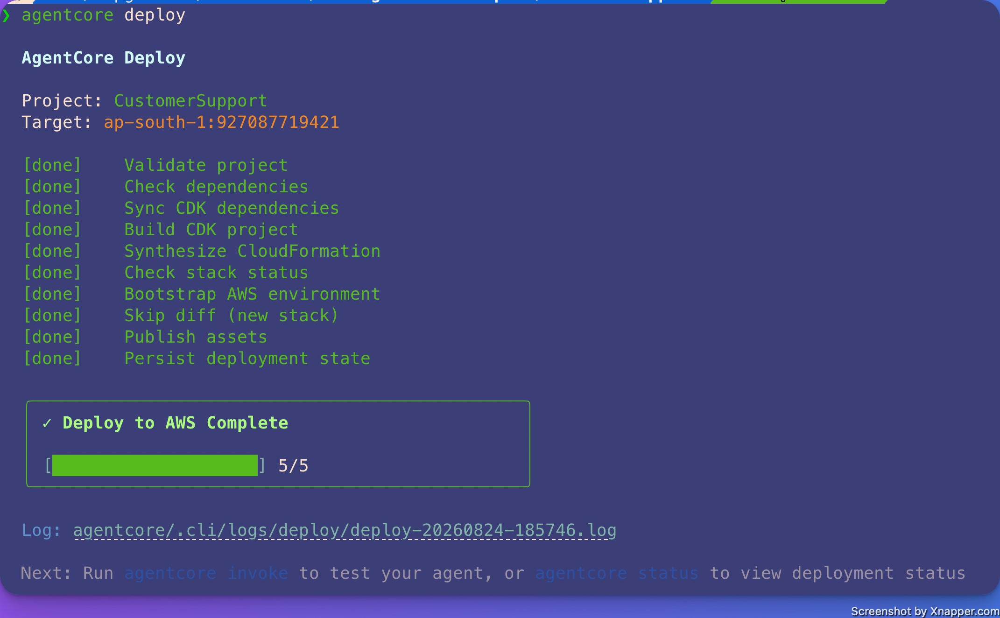
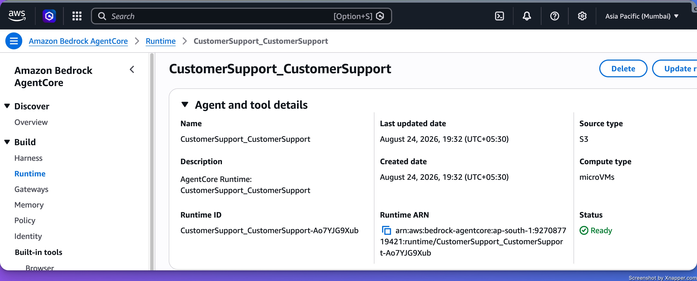

# Getting Started with Amazon Bedrock AgentCore

Follow this link: https://github.com/ckp-ai/aws-agentcore-samples/tree/main/00-getting-started.
However , some custom changes are required when we run in local laptop(e.g. macOS) with `nova-2-lite-v1:0` and in `ap-south-1` region.

## Create the agent

Unlike the example in the link, we need to provide the protocol and memory properties to run it correctly.

- So the example command gave me this error:

```bash
  ❯ agentcore create \
    --name CustomerSupport \
    --framework Strands \
    --model-provider Bedrock \
    --defaults
  Use --no-agent for project-only, or provide all: --framework, --model-provider, --memory
```

- From help, I got this:

```bash
  --framework <framework>              Agent framework (Strands, LangChain_LangGraph, GoogleADK, OpenAIAgents, VercelAI) [non-interactive]
    --model-provider <provider>          Model provider (Bedrock, Anthropic, OpenAI, Gemini) [non-interactive]
    --memory <option>                    Memory option (none, shortTerm, longAndShortTerm) [non-interactive]
    --protocol <protocol>                Protocol: HTTP, MCP, A2A, AGUI (default: HTTP) [non-interactive]
```
- My command was:

```bash
agentcore create \
  --name CustomerSupport \
  --framework Strands \
  --model-provider Bedrock \
  --protocol HTTP \
  --memory none
  ```

## Do this modification if required

Since we are using amazon bedrock nova model, in the load.py file, update the model as below:

Path: `~/aws-agentcore-samples/CustomerSupport/app/CustomerSupport/model/load.py`

```python
  def load_model() -> BedrockModel:
      """Get Bedrock model client using IAM credentials."""
      return BedrockModel(model_id="global.amazon.nova-2-lite-v1:0",region_name="ap-south-1")
  ```

## Deploy to AWS

In commandline run:

- `agentcore deploy`



Here is the output:

```log

❯ agentcore status
AgentCore Status (target: default, ap-south-1)

Agents
  CustomerSupport: Deployed - Runtime: READY (arn:aws:bedrock-agentcore:ap-south-1:927087719421:runtime/CustomerSupport_CustomerSupport-qVHFNEC6lw)
  URL: https://bedrock-agentcore.ap-south-1.amazonaws.com/runtimes/<ARN>/invocations

❯ agentcore invoke "What's the return policy for audio products?" --stream
The return policy for audio products is as follows:

- **Return Window**: 30 days from purchase date
- **Condition**: Returns accepted only for defective items after 15 days
- **Refund**: Full refund available within 15 days of return approval
- **Replacement**: Available after return approval

This means you have 30 days to return audio products, but for non-defective items, the return window starts after 15 days from purchase. Defective items can be returned anytime within the 30-day period.

Would you like me to look up any specific audio products or clarify any details about this policy?

Session: a64b0431-d718-45fd-9a26-88e49327b050
To resume: agentcore invoke --session-id a64b0431-d718-45fd-9a26-88e49327b050

```

## See the details in AWS Console

To view details in the AWS Console, navigate to:

**Amazon Bedrock AgentCore >  Runtime**



## Remove the agent:

To tear down all deployed resources:

```
  agentcore remove all
  agentcore deploy
```
This deletes the AgentCore Runtime and all associated AWS resources (IAM roles, S3 artifacts, CloudFormation stack).

## How to rerun 
I had created and deployed an agent to bedrock by these commands:


```bash
agentcore create \    
  --name CustomerSupport \    
  --framework Strands \    
  --model-provider Bedrock \    
  --protocol HTTP \    
  --memory none
```
deloyed via: `agentcore deploy`

Cleaned up using:

`agentcore remove all`

`agentcore deploy`

Now I want to rerun it. When I do agentcore deploy I see this message:

```log
❯ agentcore deploy
AgentCore Deploy
[error] Validate project
→ No resources defined in project. Add at least one resource (agent, memory, knowledge base, evaluator, or gateway) before deploying.ß
```

All the artifacts are present. How to recover from this:

**Ans:**
The error means agentcore remove all wiped the agent definition from 
agentcore.json, leaving it empty. The CLI requires at least one resource defined there before it will deploy.

agentcore remove all cleared the runtimes array in agentcore.json, leaving it empty. The fix is to add the agent runtime back using the CLI, then deploy.

Run this from inside your `CustomerSupport` directory:

```bash
agentcore add agent \
  --name CustomerSupport \
  --framework Strands \
  --model-provider Bedrock \
  --language Python \
  --memory none \
  --protocol HTTP
```
> **Note:** `--language` and `--memory` are required flags for `agentcore add agent`. Without them the command will fail.

Then verify and deploy:

```bash
agentcore validate
agentcore deploy
```

The `agentcore add agent` command re-populates the `runtimes` array in `agentcore.json` with the same config you originally used, pointing back to your existing `main.py`. Since your app code is still intact, nothing else needs to change.


## Resolving Git Config with Upstream and forked Repo

> **I have forked a public repo: https://github.com/awslabs/agentcore-samples. I added my custom files to my forked repo. If I check the repo in Github, it says:**

>This branch is 1 commit ahead of and 1 commit behind awslabs/agentcore-samples:main.
How to resolve this without affecting each other file

Merge upstream into your branch (simplest, safest)
This keeps your commit history as-is and just adds the upstream commit on top.

1. Add the upstream remote (if you haven’t already)
```bash
git remote add upstream https://github.com/awslabs/agentcore-samples.git

# If it already exists, you’ll see an error; that’s fine.
```

2. Fetch upstream changes

```bash
git fetch upstream
```
3. Checkout your branch
```bash
git checkout main
```

> or whatever branch you’re working on in your fork

4. Merge upstream/main into your branch

```bash
git merge upstream/main
```

If there are no conflicts, Git will create a merge commit and you’re done.

If there are conflicts: git will mark the conflicting files.

Open each file, resolve the conflicts (keep both your changes and upstream changes as needed).

Then:

```bash
  git add <resolved-files>
  git commit
```
5. Push the updated branch to your fork
```bash
git push origin main
```

After this, GitHub should no longer show “1 commit behind” (you may still be “X commits ahead” because of your own commits, which is expected).

This approach does not remove or overwrite your files; it just integrates upstream changes alongside them.
